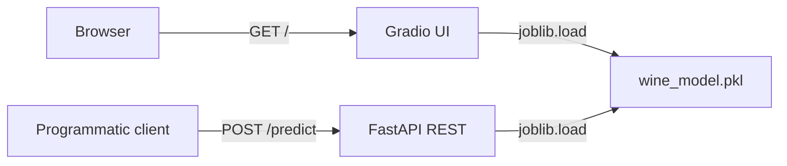

# task-api: ML-эндпоинт для классификации вина

Сервис на FastAPI + Gradio, который по 13 химическим показателям партии вина определяет сорт винограда (`class_0`, `class_1`, `class_2`). Принимает запросы как через REST (JSON), так и через браузерный Gradio-интерфейс.

- **Live demo:** https://<ваш-поддомен>.nip.io/
- **Swagger UI:** https://<ваш-поддомен>.nip.io/docs
- **Health-check:** https://<ваш-поддомен>.nip.io/health

## Что внутри

- `wine_train_practice.ipynb` + `wine_train_solution.ipynb` (из материалов недели, обучаются отдельно от репозитория) — обучение `DecisionTreeClassifier` на `sklearn.datasets.load_wine` с label noise 15% в train, подбор регуляризации (`max_depth=4`) через `GridSearchCV`. Регуляризация поднимает test accuracy с 0.76 (baseline) до 0.83 и сжимает train/test gap с 0.24 до 0.10
- `app/main.py` — FastAPI с lifespan-загрузкой модели + REST `/predict` + смонтированный Gradio на корневом пути `/`
- `models/wine_model.pkl` — сериализованный `DecisionTreeClassifier`. В git не хранится, собирается ноутбуком
- `tests/` — pytest-тесты на REST-эндпоинт и Gradio-роут
- `Dockerfile` + `.github/workflows/` — CI/CD, автодеплой на VPS через GHCR + SSH

## Архитектура



## Как запустить локально

```bash
conda create -n task-api python=3.11 -y
conda activate task-api
pip install -r requirements.txt

# 1) убедитесь, что обученная модель лежит в models/wine_model.pkl
#    (её обучает отдельный ноутбук на Шаге 1 и копирует в models/ Шаг 7)

# 2) запускаем сервис
uvicorn app.main:app --reload
```

Откройте `http://127.0.0.1:8000/` для Gradio, `http://127.0.0.1:8000/docs` для Swagger.

## Скриншот


## Стек

Python 3.11 · FastAPI · Pydantic v2 · scikit-learn 1.6 · Gradio 5 · pytest · Docker · GitHub Actions · GHCR · nginx · Let's Encrypt